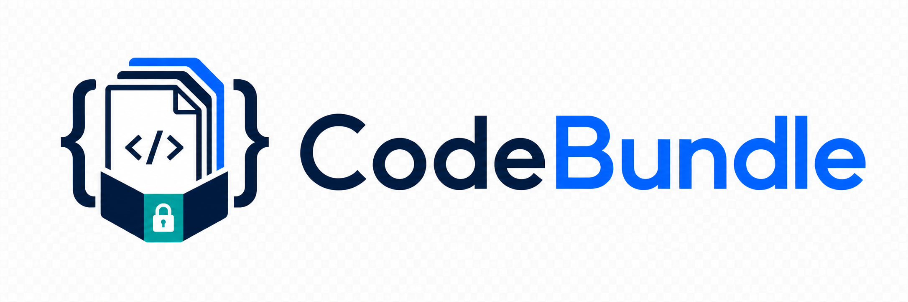

# CodeBundle



CodeBundle bundles selected project files into one Markdown or text export for AI review, code sharing, automation, and CI/CD workflows.

It has two local execution paths:

- Desktop app: an Electron UI for choosing a project folder, scanning files, selecting files/folders, choosing an output file, and running the local exporter.
- Python CLI: a standalone automation tool that reads a JSON config and writes the final export.

CodeBundle is local-first. It does not upload files, does not call cloud services, and does not store secrets. The desktop app calls the Python CLI on the same machine.

Status: MVP development build with release packaging foundation. Development mode requires Node/npm, Python 3.10+, and access to `exporter-python`. Public desktop builds include the Electron runtime and a bundled exporter sidecar so installed users do not manually install Python, Node, npm, Python packages, or project dependencies.

Latest public release:

```text
https://github.com/jkjitendra/codebundle/releases/latest
```

## Quick Start

Run these commands from the repository root unless stated otherwise.

Install and run the desktop app:

```bash
cd apps/desktop
npm install
npm run dev
```

Install and run the Python exporter:

```bash
pip install -e exporter-python
python -m codebundle_exporter --config shared/codebundle.config.example.json
```

## Desktop Usage

1. Open the desktop app with `npm run dev`.
2. Choose a project folder.
3. Scan the folder.
4. Select files and folders in the tree.
5. Choose an output `.md` or `.txt` file.
6. Click `Run Export`.
7. Use `Reveal Output` after export succeeds.

The desktop app requires Python 3.10+ for the current MVP runtime. You can set `CODEBUNDLE_PYTHON_PATH` to point at a specific Python executable.

## Python CLI Usage

The Python exporter accepts a shared JSON config:

```bash
python -m codebundle_exporter --config path/to/codebundle.config.json
```

stdout contains exactly one JSON object so scripts and the desktop app can parse results safely. See `docs/python-automation.md`.

## Documentation

- [Desktop App Guide](apps/desktop/README.md)
- [Python Exporter Guide](exporter-python/README.md)
- [Security Notes](docs/security.md)
- [Desktop Packaging Notes](docs/desktop-packaging.md)
- [Release Checklist](docs/release-checklist.md)
- [Website And Netlify Integration](docs/website-netlify-integration.md)
- [Python Automation Guide](docs/python-automation.md)

## Project Structure

```text
codebundle/
  exporter-python/
    codebundle_exporter/
    tests/
  apps/
    desktop/
      src/
      tests/
  shared/
  docs/
```

## Security Model

- Renderer code does not access Node.js APIs directly.
- Filesystem scanning happens in the Electron main process.
- Scan responses contain metadata only, not file contents.
- Python reads file contents only during export.
- Default excludes skip `.env`, keys, credentials, `.git`, `node_modules`, build outputs, lock files, and common binary formats.
- Dangerous roots such as `/`, `/etc`, `/usr`, `/System`, `/Library`, and Windows system roots are blocked.
- Path traversal attempts are rejected.

See `docs/security.md` for details.

## Test Commands

Python:

```bash
cd exporter-python
pytest
```

Desktop:

```bash
cd apps/desktop
npm ci
npm test
npm run typecheck
npm run build
```

Release packaging preflight:

```bash
cd apps/desktop
npm run sidecar:build
npm run sidecar:verify
npm run package:dir
```

Create a public release by pushing a `v*` tag, for example:

```bash
git tag v0.1.0
git push origin v0.1.0
```

GitHub Actions builds macOS, Windows, and Linux artifacts, builds the platform Python sidecar on each runner, and attaches installers/packages to the GitHub Release.

## Current MVP Limitations

- Production signing, notarization, and installer release flow are not implemented yet.
- Current CI artifacts are unsigned beta builds.
- `npm audit` reports Electron, electron-builder build-chain, and Vite/electron-vite advisories that require targeted breaking upgrades before a stable public release.
- Sidecars must be built per target OS before packaging.
- Development mode still needs Python 3.10+ and Node/npm.
- `.gitignore` support is simple root `.gitignore` pattern support, not full Git-compatible matching.
- Export progress is coarse.
- Failed export temp configs may be kept for debugging.

## Troubleshooting

### Python Not Found

Install Python 3.10+ or set:

```bash
export CODEBUNDLE_PYTHON_PATH=/path/to/python3
```

### Exporter Module Not Found

Run the desktop app from the repository development setup. Public packaged builds use the bundled sidecar under app resources and do not use local Python.

### Output File Is Empty Or Missing

Check the selected files, exclude patterns, and export summary.
